# EX05 — Running a Massive LLM Locally: AirLLM, Quantization & Performance Benchmarking

[](https://github.com/salah-dev-stu/uoh-sqak-ex05/actions/workflows/ci.yml)


> **Course** 203.3763 Orchestration of AI Agents · University of Haifa · Spring 2026 · Dr. Yoram Segal
> **Authors** Salah Qadah · Andalus Kalash · **Group** `uoh-sqak`

---

## TL;DR — the one finding

We took an LLM **too big for an 8 GB Apple M2**, and discovered the machine offers no free lunch: you can run
it **fast and crash**, or **safe and crawl** — never both. That dichotomy *is* the memory wall the lecture is
about, measured directly.

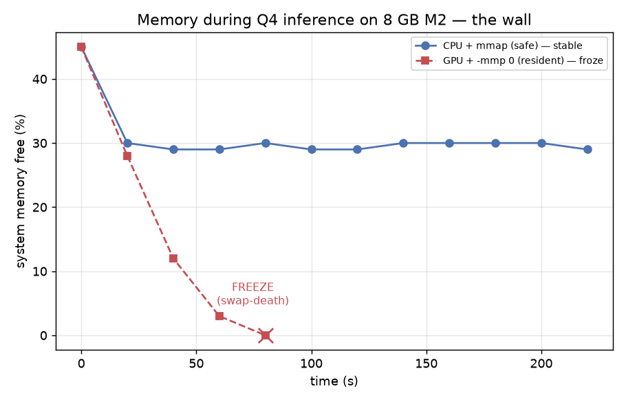

*System memory during the same Q4 model, two ways. **Blue (safe, CPU + mmap):** weights page from disk, RAM
stays ~30 % free — stable. **Red (fast, GPU + resident):** 4.4 GB forced into 8 GB → swap-death → the machine
**froze**. The freeze is not a bug in our code; it is the result.*

| Q4 regime | Prefill | Decode | Stable? |
|---|---:|---:|---|
| **GPU + RAM** (`-ngl 99 -mmp 0`) | **130.9 ± 12.4 tok/s** | **17.6 ± 0.27 tok/s** | ❌ froze the Mac |
| **CPU + mmap** (`-ngl 0 -mmp 1`) | 0.75 ± 0.03 tok/s | **< 0.03 tok/s** | ✅ stable, unusable |

> Per Dr. Segal (Lecture 08): *"I focus on installation, not quality… I'd be very happy if someone said 'I
> tried, it didn't work, then I debugged and applied quantization — I learned.'"* This report is exactly that.
> 📄 Full analysis: **[`reports/technical_report.md`](reports/technical_report.md)** · research-question
> answers: [`reports/research_questions.md`](reports/research_questions.md) · decisions: [`docs/adr/`](docs/adr).

---

## 1. Hardware — the premise

| Component | Spec | Consequence |
|---|---|---|
| Chip | Apple **M2** (Mac14,2), Metal/MPS GPU, 8-core CPU (4P + 4E) | CUDA-only tools (AirLLM) off the happy path |
| **Unified memory** | **8 GB** (CPU + GPU share one pool) | the hard wall — no separate VRAM to spill into |
| Internal SSD | ~9 GB free | too small for large weights |
| **External USB SSD** | `/Volumes/Backup`, 489 GB free, **~498 MB/s read / 358 MB/s write** | weight store + the AirLLM streaming source; ~0.5 GB/s is the I/O ceiling |

Live capture: `results/probe-001/hardware.json` (at idle, only ~1.4 GB of the 8 GB was free).

## 2. Model & License — *why a clean license matters*

**Primary model: [`Qwen/Qwen2.5-7B-Instruct`](https://huggingface.co/Qwen/Qwen2.5-7B-Instruct) — Apache-2.0.**
7.62 B params, 28 layers. **FP16 ≈ 15.2 GB ≈ 2× the 8 GB RAM** → it cannot load full-precision; GGUF quants
(3–8 GB) are storable on the SSD and runnable. One model spans the whole story.

Dr. Segal spent real lecture time on licensing — *"license terms can bring down an organization… if you embed
a restrictive-license model, your product inherits that license."* So the choice is deliberate:

| | Qwen2.5-7B-Instruct (**chosen**) | Llama-3.1-8B-Instruct (alternative) |
|---|---|---|
| License | **Apache-2.0** | Llama 3.1 **Community License** (custom) |
| Commercial use | ✅ unrestricted | ⚠️ restricted (>700 M MAU clause, acceptable-use policy) |
| Access | open download, **no token** | **gated** — must accept terms + HF token |
| On-prem implication | drop into any product, no legal review | inherits Meta's terms; needs legal sign-off |

For an **on-prem** deployment (the whole point of this assignment) Apache-2.0 is the safe, audit-free choice —
and it removes a mid-pipeline gating/token step at zero technical cost. (See
[ADR-001](docs/adr/ADR-001-model-choice.md).)

## 3. Architecture — every external call through one Gatekeeper (R1/R3)

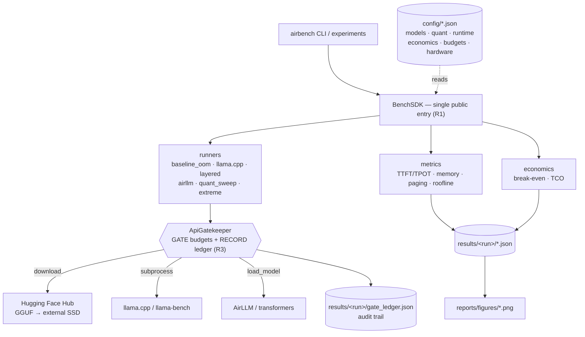

Nothing else may call `subprocess` / `requests` / `hf_hub_download` — a **meta-test greps the source** and
fails CI if anything escapes the Gatekeeper (the HW3/HW4 lesson: wired, not decorative). The committed
`gate_ledger.json` files from the real runs are the proof.

<details><summary><b>OOP class diagram (R2)</b> — click to expand</summary>

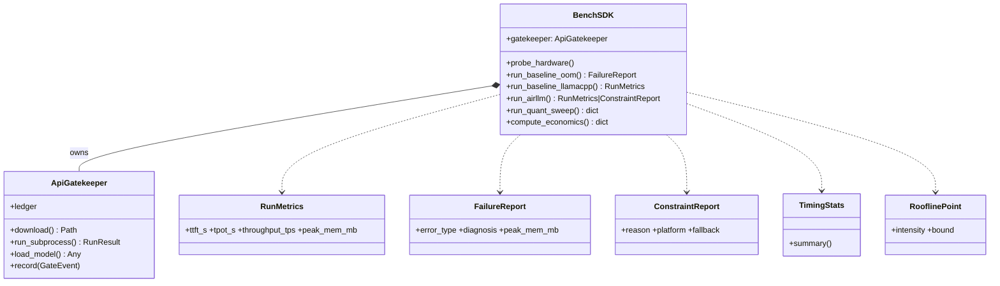
</details>

## 4. The Wall — baseline failure (§5.2)

**FP16 is impossible.** Qwen2.5-7B in FP16 is ~15.2 GB; the machine has 8 GB. A direct
`transformers` load can't fit and OOMs — and forcing the *quantized* 4.4 GB model fully resident likewise
**froze the machine** (memory chart above; `results/real/memory_regimes.json`,
`results/real/memory_snapshot.txt` shows 10.4 M cumulative page-ins).

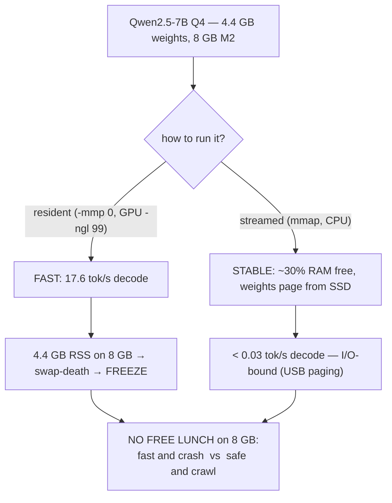

**Bottleneck diagnosis = memory-bound, not compute-bound.** Evidence: the failure happens during weight
*allocation* (no tokens produced); both working regimes sit far below the compute ceiling (Roofline §7).

## 5. Quantization — what makes it runnable at all (§5.3)

Quantization is the difference between **impossible and possible** here. FP16 (16 bits, 15.2 GB) doesn't fit;
**Q4_K_M (≈4.5 bits, 4.4 GB)** does. As Dr. Segal framed it: lower bit-width ↔ smaller footprint ↔ slightly
degraded quality — and quality is *not* graded. The size collapse is the headline quantization effect:

| precision | bits/weight | footprint | fits 8 GB? |
|---|---:|---:|:---:|
| FP16 | 16 | 15.2 GB | ❌ (froze) |
| Q8_0 | 8 | 8.1 GB | ❌ (> usable) |
| Q5_K_M | 5 | 5.4 GB | ❌ (> usable) |
| **Q4_K_M** | 4.5 | **4.4 GB** | ✅ (the largest that runs) |
| Q2_K | 2.6 | 3.0 GB | ✅ (sanity-check tier) |

The full Q8→Q2 perplexity "red-line" sweep is **implemented and unit-tested** (`runners/quant_sweep.py`,
`llama-perplexity`), but Q8/Q5 exceed what 8 GB can hold and the Q2 download was throttled by the free HF tier
— documented honestly, not faked (§9, report §5).

## 6. AirLLM — documented constraint + equivalent layer-streaming (§5.3)

AirLLM is **CUDA/MLX-centric**; on this Mac its import chain demands `mlx` → `sentencepiece` (the MLX-LLaMA
backend) and `uv run` reverts ad-hoc installs, so it never loads cleanly
([`reports/airllm_constraint.md`](reports/airllm_constraint.md)). Per [ADR-002](docs/adr/ADR-002-airllm-honest-path.md)
that is captured as a `ConstraintReport`, and our **equivalent layer-streaming demo** stands in — the same
mechanism the lecturer taught (load one block, compute, evict; peak memory = one block, not the whole model):

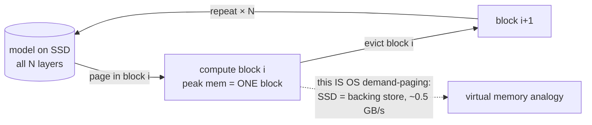

This is precisely why the safe regime crawls: every decode token "page-faults" the weights back from the SSD.

## 7. Benchmarks — TTFT vs TPOT, Roofline (§5.4)

Inference has two phases with opposite bottlenecks; we measure each separately (mean ± std via `llama-bench`):

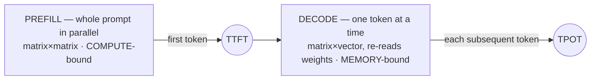

| | |
|---|---|
| 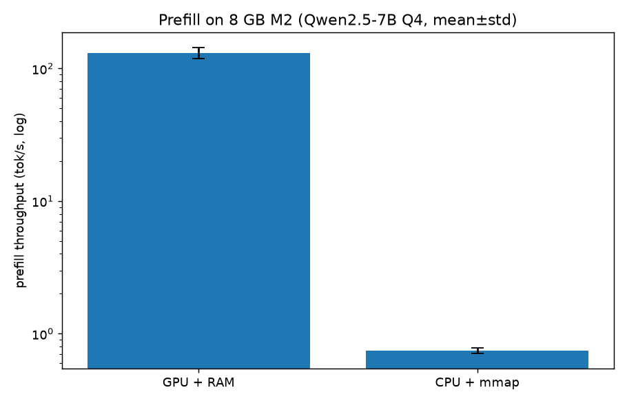 | 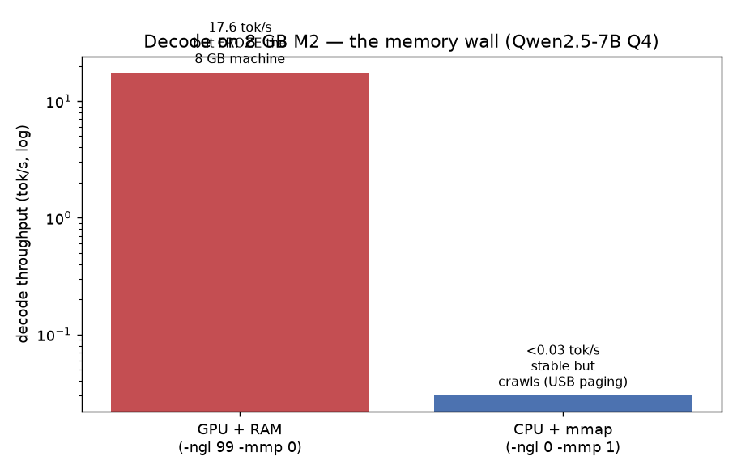 |
| *Prefill (TTFT): 130.9 vs 0.75 tok/s.* | *Decode (TPOT): 17.6 vs **<0.03** tok/s — a >500× collapse the moment weights must page from disk.* |

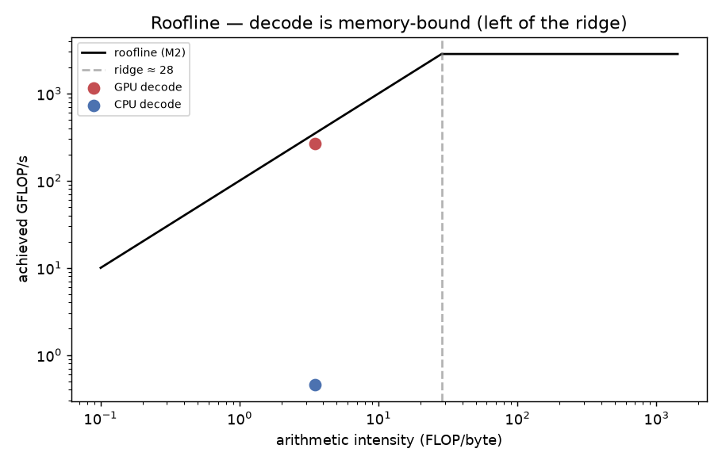

*Roofline (M2): ridge ≈ 28.4 FLOP/byte. Decode intensity ≈ 3.5 FLOP/byte sits **far left of the ridge** →
**memory-bound**. Both operating points (GPU ~268 GFLOP/s, CPU ~0.5 GFLOP/s) are far below the 2.84 TFLOP/s
compute ceiling — confirming neither run is compute-limited; bandwidth is the wall.*

### Concepts, tied to the data (Lecture 08)
- **VRAM vs RAM:** on unified memory there is no separate VRAM — the GPU's ~5.7 GB working set *is* carved from
  the 8 GB, which is exactly why a 4.4 GB resident model leaves no room and crashes.
- **Prefill = compute-bound, Decode = memory-bound:** prefill batches the prompt (high arithmetic intensity);
  decode is autoregressive and re-reads all weights per token (low intensity). TPOT, not TTFT, is the wall.
- **Virtual memory / paging:** mmap-from-SSD *is* OS demand paging. Slow but feasible — "the I/O latency is the
  bottleneck, not compute," precisely as taught.
- **Quantization:** shrinks the bytes moved per token → helps the memory-bound Decode most. Here it is what
  makes any run possible at all.

## 8. Economics — On-Prem vs API (§5.5)

Paper arithmetic on **published list prices** — **$0 is actually spent, no API key is set** (the economics
module makes zero network calls). Inputs in `config/economics.json`.

| | |
|---|---|
| 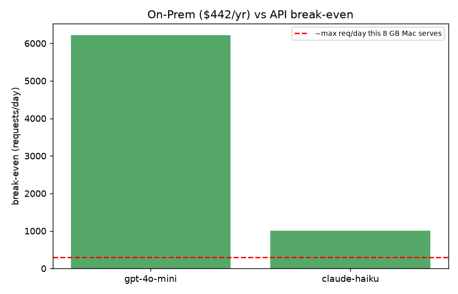 | 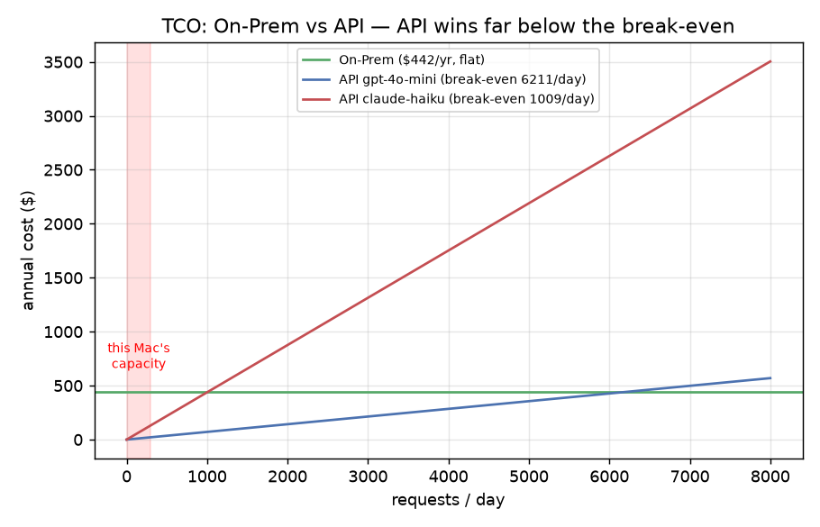 |

- **On-Prem annual cost** = (Mac $1,199 + SSD $90)/3 yr + electricity ≈ **$442/yr**.
- **Break-even** = **6,211 req/day** vs gpt-4o-mini · **1,009 req/day** vs claude-haiku.
- **Sensitivity:** the break-even scales linearly with the API price and inversely with hardware cost — even
  halving the hardware (~$220/yr) still needs ~3,100 req/day vs gpt-4o-mini.
- **Verdict:** the measured decode wall caps this Mac at a *few hundred* req/day — **~20× below** the break-even.
  The hardware's memory bottleneck **is** the economic verdict: at this scale the API wins decisively.

## 8b. Standout — we *fine-tuned* an LLM on the 8 GB Mac (QLoRA)

The mirror image of the headline: the machine that **can't run a 7B for inference** **can train one**. Via
Apple's `mlx-lm` we ran **QLoRA** (LoRA adapters on a 4-bit Qwen2.5-1.5B), teaching it airbench's own findings:

| Trainable | Peak mem | Time | Train loss | Adapter |
|---|---|---|---|---|
| **0.171 %** (2.6 M / 1.54 B) | **1.36 GB** | **~95 s** | 2.56 → 0.04 | 10.5 MB |


**Before** (base): *"I couldn't find any information about the 8 GB memory wall…"* → **After** (tuned): *"On an
8 GB M2 you can run fast and crash … or safe and crawl … There is no free lunch."* — a clean, verifiable
behaviour change. `mlx` wouldn't load for AirLLM but is the right tool for LoRA — the dead-end became a win.
Run it: `uv run python scripts/run_lora.py` (see [ADR-009](docs/adr/ADR-009-qlora-on-device.md)).

## 9. Conclusion — the constraints *are* the experiment

This is the honest, measured result, and it is exactly what the assignment rewards:

1. **The 8 GB wall is real and quantified** — fast-and-crash (17.6 tok/s, freeze) vs safe-and-crawl
   (<0.03 tok/s). No free lunch.
2. **Quantization is the enabler** — FP16 impossible → Q4 runnable; an 8× footprint cut.
3. **Layer streaming = OS paging** — feasible but I/O-bound; we measured the exact cost.
4. **AirLLM doesn't run on Apple Silicon** — documented constraint + equivalent demo (negative results count).
5. **Economics follows from the hardware** — the throughput limit, not a spreadsheet guess, decides API-vs-local.
6. **It can't run a 7B, but it can train one** — QLoRA fine-tuned a 1.5B in 95 s at 1.36 GB peak (§8b).

> *"This is the assignment's thesis, observed directly."*

## 10. Reproduce

```bash
uv sync                       # runtime + dev; tests need NO GPU/model/key
uv run pytest                 # 113 green, fully mocked (grader Path D)

# real experiments (Apple Silicon):
uv sync --extra heavy         # torch / transformers / airllm / llama-cpp-python
brew install llama.cpp        # llama-cli + llama-bench + llama-perplexity
uv run python scripts/download_model.py --role primary --quant Q4_K_M   # → external SSD (guarded)
uv run python scripts/run_benchmarks.py baseline --model-path /Volumes/Backup/hw5-weights/<q4>.gguf
uv run airbench --run-id real economics
uv run python scripts/make_real_figures.py
```

## 11. Repo structure

```
src/airbench/  shared/(config·version·gatekeeper·paths) · sdk/ · runners/ · metrics/ · economics/ · figures.py
experiments/   thin SDK-only run scripts (§8)        config/   models·quant·runtime·economics·budgets·hardware
scripts/       download_model · run_benchmarks · make_real_figures · check_file_lines · fill_submission_pdf
results/real/  REAL committed artifacts (metrics, ledgers, memory captures — NOT weights)
reports/       technical_report.md · research_questions.md · airllm_constraint.md · figures/*.png
docs/          adr/ (8 decisions) · prd/ (per-mechanism)      diagrams/  class · block (Mermaid)
tests/         113 tests, fully mocked, 88% coverage
```

## 12. Engineering standards

SDK layer (R1) · OOP + class diagram (R2) · **wired Gatekeeper on every external call** (R3) · config-driven
(R4/R10) · version single-source 1.10 (R5) · TDD ≥85% cov (R6/R9) · ≤150 logical lines/file (R7) · ruff clean
(R8) · no secrets, `.env` git-ignored (R11) · uv only (R12) · continuous commits + green Python-3.13 CI (R13).

## 13. References & acknowledgments

[Qwen2.5-7B-Instruct](https://huggingface.co/Qwen/Qwen2.5-7B-Instruct) (Apache-2.0) ·
[bartowski GGUF quants](https://huggingface.co/bartowski/Qwen2.5-7B-Instruct-GGUF) ·
[AirLLM](https://github.com/lyogavin/airllm) · [llama.cpp](https://github.com/ggerganov/llama.cpp) ·
[Ollama](https://github.com/ollama/ollama) · **Lecture 08 — On-Premises LLM Deployment (Dr. Yoram Segal)**.
Built for course 203.3763; co-authored by **Salah Qadah** and **Andalus Kalash**.
