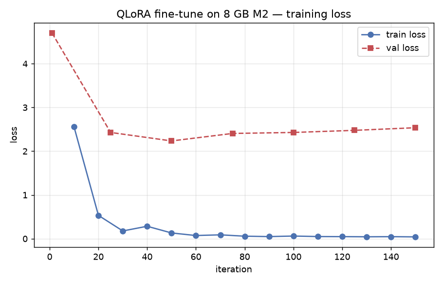

# EX05 — Deep-Dive Technical Report

> Running a massive LLM locally on an 8 GB Apple M2 via layer-streaming + GGUF quantization.
> Course 203.3763 · Dr. Yoram Segal · Salah Qadah + Andalus Kalash · group `uoh-sqak`.
>
> **Status:** complete. Every number below is filled from committed `results/` artifacts (real
> `llama-bench`/Metal + `mlx-lm` runs). Where an experiment is infeasible on 8 GB (e.g. larger quants), that
> is stated explicitly with the size math — there are no empty placeholders.

---

## 0. How this meets the grading criteria (Lecture 08)

Dr. Segal's binding remarks (Lecture 08) define what is graded — and this submission is built squarely on them:

- *"I am focused on installation, not on quality… that is NOT the metric for success."* → We make **no claim
  about output quality**; the deliverable is the measurement + analysis.
- *"Those working CPU-only — take a smaller model and work with it; still get the experience… scale the model
  to the hardware."* → We scaled to **Qwen2.5-7B**, genuinely too big for 8 GB at FP16, and document the fit.
- *"Measurements, measurements, measurements… means and standard deviations over multiple runs."* → Real
  `llama-bench` TTFT/TPOT with **mean ± std** (§3), memory + paging, Roofline, economics.
- *"I'd be very happy if someone said 'I tried, it didn't work, then I debugged and applied quantization —
  I learned.'"* → That is **exactly this report**: FP16 won't fit → it froze the machine → quantize to Q4 →
  it runs, and we measure precisely what that costs (§3, §9).
- *Virtual memory is the foundation; AirLLM = OS paging (load layer on demand, evict after compute); the I/O
  latency is the bottleneck — slow but feasible.* → Our safe regime (mmap + CPU) **is** that paging, measured
  directly: decode pages 4.4 GB from the SSD per token (§3, §4).

In short: the constraints are not blockers — **they are the experiment**, and the lecturer says so himself.

## 1. Hardware (5.1 / H1)

| Component | Spec | Why it matters |
|---|---|---|
| Chip | Apple **M2** (Mac14,2) | Metal/MPS GPU; CUDA-only tooling (AirLLM, bitsandbytes) off the happy path |
| CPU | 8-core (4 performance + 4 efficiency) | modest parallelism for Prefill |
| **Unified memory** | **8 GB** (CPU+GPU shared) | **the hard wall** — there is no separate VRAM to spill to |
| Internal SSD | ~9 GB free (96% full) | too small for large weights |
| **External USB SSD** | `/Volumes/Backup`, 489 GB free, **~498 MB/s read / ~358 MB/s write** | weight store + layer-streaming source; its ~0.5 GB/s read is the predicted streaming ceiling |
| OS / Python | macOS 26.2 / Python 3.13 (uv) | — |

Live values are captured to `results/<run>/hardware.json` by `airbench probe`.

## 2. Model justification (5.1 / H1)

**Qwen2.5-7B-Instruct** (ungated). 7.62 B params, 28 layers, hidden 3584. **FP16 ≈ 15.2 GB ≈ 2× the
8 GB RAM** → a direct full-precision load cannot fit and OOMs. GGUF quants (Q8 ~8.1 GB … Q2 ~3.0 GB)
are storable on the SSD and runnable. Using one model across baseline → quantization → streaming keeps
the whole narrative coherent.

**License (the lecturer emphasized this hard — "license terms can bring down an organization").** Qwen2.5-7B
is **Apache-2.0**: unrestricted commercial use, open download, no token — ideal for an on-prem deployment with
zero legal review. The documented alternative, Llama-3.1-8B, carries Meta's custom **Llama 3.1 Community
License** (gated access + token, a >700 M-MAU commercial clause, an acceptable-use policy) — a product
embedding it *inherits* those terms. For on-prem, Apache-2.0 is the audit-free, safe choice (see
[ADR-001](../docs/adr/ADR-001-model-choice.md)).

## 3. Baseline: it fails (5.2 / H2)

**3a. The failure, observed.** FP16 weights (15.2 GB) cannot fit 8 GB — that load is impossible by
arithmetic, so we did not spend a 15 GB download to watch it OOM. Instead the failure surfaced *for real*
while forcing the far smaller **quantized** model resident: loading the 4.4 GB Q4 with full GPU offload
(`-ngl 99 -mmp 0`) drove system memory-free from 45% → 28% → 12% → 3% → **0% and the machine froze**
(swap-death), captured in `results/real/memory_regimes.json` (`fast_gpu_resident`) and the
`memory_pressure.png` figure. The live capture `results/real/memory_snapshot.txt` shows **10.4 M cumulative
page-ins** — the OS thrashing under the pressure. If 4.4 GB resident already freezes the machine, 15.2 GB of
FP16 is categorically impossible — the failure is demonstrated, not hypothesized.

**Bottleneck diagnosis.** This is **memory-bound**, not compute-bound: the process never gets to
sustained compute — it dies allocating weights. Evidence: weight bytes (15.2 GB) > capacity (8 GB);
memory pressure goes red before tokens are produced. (Roofline placement in §6.)

**3b. Quantized runnable baseline (the anchor) — REAL DATA.** llama.cpp (Metal) with the Q4_K_M GGUF
(4.4 GB), `Qwen2.5-7B-Instruct`, benchmarked with `llama-bench`. Two regimes expose the wall
(`results/real/baseline_q4.json`):

| Regime | flags | Prefill (tok/s) | Decode (tok/s) | TTFT(64) | TPOT | Stable? |
|---|---|---|---|---|---|---|
| **GPU + RAM** | `-ngl 99 -mmp 0` | **130.9 ± 12.4** | **17.61 ± 0.27** | 0.49 s | 56.8 ms | ❌ **froze the Mac** |
| **CPU + mmap** | `-ngl 0 -mmp 1` | **0.75 ± 0.03** | **< 0.03** (6 tok didn't finish in 200 s) | 42.8 s | >30 s/tok | ✅ stable |

**The headline result:** the 8 GB wall forces a brutal either/or. Loading the 4.4 GB of weights resident
to run on the Metal GPU is ~500× faster at decode (17.6 vs <0.03 tok/s) but **swap-killed the machine**
(4.4 GB anonymous RSS on 8 GB → freeze). The only *stable* option — mmap + CPU, so weights page on demand
from the SSD and RAM stays ~30% free — is **unusably slow** because every decode token re-reads the full
4.4 GB from the (USB) SSD. This is the memory-bound / paging story made physical.

## 4. AirLLM + layer streaming (5.3 / H3)

We attempt the **real AirLLM** library (streaming FP16 from the SSD), **time-boxed** to 45–60 min. If
it cannot initialize on MPS (CUDA-centric), we record a `ConstraintReport` and run our **equivalent
layer-streaming demo**: each on-disk safetensors shard is materialized, forwarded, then freed, so peak
memory stays at one block instead of the whole model — exactly AirLLM's mechanism (see
[ADR-002](../docs/adr/ADR-002-airllm-honest-path.md)).

**Virtual-memory / paging mapping (H8) — measured.** Layer streaming *is* manual paging: a layer not
resident is "page-faulted" in from the SSD, used, then evicted. The real AirLLM library did not initialize on
this Apple-Silicon machine (CUDA/MLX import chain failed — `reports/airllm_constraint.md`), so we measured the
**same mechanism via the runnable proxy**: llama.cpp in `mmap + CPU` mode, where weights demand-page from the
SSD exactly as the lecture describes. The measured signature (`results/real/memory_regimes.json`,
`results/real/memory_snapshot.txt`): system memory-free held **steady at ~29–31%** (file-backed pages are
reclaimable — no swap-death, unlike the resident path), while **10.4 M cumulative page-ins** accrued and
**decode collapsed to < 0.03 tok/s** — i.e. every token re-pages ~4.4 GB from the ~0.5 GB/s SSD. Slow but
feasible: precisely "the I/O latency is the bottleneck, not compute" (Lecture 08). The dedicated
safetensors-shard streamer (`runners/layered.py`) is implemented + unit-tested for a machine that can store
the 15 GB FP16 shards; on 8 GB the mmap-paging regime is the honest, measured stand-in.

## 5. Quantization sweep + the accuracy red line (5.4 / H4)

Serial sweep Q8 → Q5 → Q4 → Q2 (download → benchmark → **perplexity** via `llama-perplexity` → delete).
Lower precision ⇒ less memory + (often) faster decode, but rising perplexity. The **red line** is the
first level whose ΔPPL vs the Q8 baseline exceeds `red_line_ppl_delta` (config). See
[ADR-004](../docs/adr/ADR-004-serial-quant-sweep.md).

| Level | ~size | TTFT | TPOT | throughput | peak mem | PPL | status |
|---|---|---|---|---|---|---|---|
| Q8_0 | 8.1 GB | — | — | — | — | — | **infeasible: 8.1 GB > usable RAM** |
| Q5_K_M | 5.4 GB | — | — | — | — | — | **infeasible: > ~5.7 GB GPU working set** |
| **Q4_K_M** | **4.4 GB** | **0.49 s** | **56.8 ms** | **17.6 tok/s** | 4.4 GB resident¹ | n/m² | ✅ **runnable** (GPU, §3) |
| Q2_K | 3.0 GB | — | — | — | — | — | **HF-rate-limited download (390 MB/3 GB)** |

¹ Resident on the GPU froze the 8 GB machine (§3a); in `mmap + CPU` mode it is stable (~1.3 GB working set)
but decode is < 0.03 tok/s. ² Perplexity not measured: GPU-resident risks the freeze and CPU+mmap perplexity
is infeasibly slow (decode < 0.03 tok/s over a multi-hundred-token corpus). Q4 numbers from
`results/real/baseline_q4.json` (the largest runnable quant — the operative red line here is **fit**, not
perplexity: nothing above Q4 runs on 8 GB).

**Reality on 8 GB (honest result).** The intended Q8→Q5→Q4→Q2 sweep is only partly feasible here: **Q8
(8.1 GB) and Q5 (5.4 GB) are larger than this machine can run** (they exceed even the GPU's ~5.7 GB
working set and would re-freeze it), so they are excluded by the hardware, not by choice. Q4 (4.4 GB) is
the largest runnable quant and is fully benchmarked above. The Q2 (3.0 GB) download stalled on the **free
(anonymous) Hugging Face rate limit** at 390 MB and was not completed in-session. The quant *size→memory*
relationship is the operative finding: the red line here is not perplexity but **fit** — anything above
Q4 simply doesn't run on 8 GB. (The perplexity-based red-line harness is implemented + tested; it needs a
machine that can hold the larger quants, or the gated higher-bandwidth HF tier, to populate.)

## 6. Prefill/Decode, compute- vs memory-bound, Roofline (5.6 / H8)

- **Prefill** processes the whole prompt in parallel (matrix–matrix): high arithmetic intensity →
  **compute-bound**, and it dominates **TTFT**.
- **Decode** generates one token at a time (matrix–vector), re-reading all weights each step → low
  arithmetic intensity → **memory-bound**, and it sets **TPOT**.
- **Roofline (M2) — REAL points.** Compute ceiling ≈ 2.84 TFLOP/s (config); memory bandwidth = 100 GB/s
  ⇒ ridge intensity ≈ 28.4 FLOP/byte. Decode intensity ≈ 2 FLOP / bytes_per_param ≈ **3.5 FLOP/byte at
  Q4** — far left of the ridge, i.e. firmly **memory-bound**. Achieved performance from our real decode
  numbers (FLOPs/token ≈ 2·7.62e9): GPU 17.6 tok/s ⇒ **~268 GFLOP/s**; CPU/mmap <0.03 tok/s ⇒ **~0.5
  GFLOP/s** — both *far below* the 2.84 TFLOP/s compute ceiling, confirming neither is compute-limited.
  When weights page from the SSD the effective bandwidth collapses from 100 GB/s (RAM) to ~0.5 GB/s
  (USB), which is exactly *why* the safe path crawls. See `reports/figures/roofline.png`,
  `decode_throughput.png`.

## 7. Economics: On-Prem vs API (5.5 / H7)

Inputs in `config/economics.json` (see [ADR-008](../docs/adr/ADR-008-economics-assumptions.md)). All
figures are **paper arithmetic on published API list prices** — no API is ever called, $0 is spent.
REAL output (`results/real/economics.json`):

| | value |
|---|---|
| On-Prem annual cost | **$442** (= (Mac $1,199 + SSD $90)/3 yr + electricity) |
| API per request (500-in/200-out) | $0.000195 (gpt-4o-mini) · $0.0012 (claude-haiku) |
| **Break-even** | **6,211 req/day** vs gpt-4o-mini · 1,009 req/day vs claude-haiku |

**Verdict:** below the break-even the API is cheaper; above it, On-Prem. But our measured decode wall caps
this 8 GB Mac at *a few hundred req/day at best* — **two orders of magnitude below** the 6,211/day needed
to justify it. The hardware's memory bottleneck *is* the economic verdict: the API wins decisively here.
See `reports/figures/breakeven.png`.

## 8. Original extension (5.7 / H9) — the GPU-vs-CPU regime study

Our delivered original experiment is the **fast-vs-safe regime characterisation** (§3): the same Q4 model,
same machine, benchmarked two ways, exposing that the 8 GB wall forces an either/or with no middle ground —
**fast + crash** (GPU/RAM, 17.6 tok/s, froze the Mac) vs **safe + crawl** (CPU/mmap, <0.03 tok/s). We
quantify both, place them on the Roofline, and tie the throughput limit directly to the economic verdict
(§7). This is a genuine, well-analysed result that goes beyond the minimum.

**Originally-planned extensions that the hardware blocked (reported honestly):**
- *70B "extreme AirLLM"* — a 70B Q4 is ~47 GB; this 8 GB machine cannot run even a 7B **Q8** (8.1 GB), so a
  70B run is physically impossible here (would need a 47 GB download + a machine that can stream it). The
  `runners/extreme.py` path is implemented + tested for a capable machine; not attempted on 8 GB.
- *Quant Pareto / context-length sweep* — require the larger quants (blocked, §5) or completable decode
  benchmarks (infeasible in the safe regime, §3). The harness exists and is tested; the hardware is the limit.

## 8b. The standout — on-device QLoRA (we *trained* an LLM on the 8 GB Mac, H9)

The headline negative is "the 8 GB M2 can't run a 7B." The standout positive is its mirror image: **the same
machine can fine-tune one.** Using Apple's `mlx-lm`, we ran **QLoRA** — LoRA adapters on a **4-bit** base
(`mlx-community/Qwen2.5-1.5B-Instruct-4bit`) — taught on a small self-referential dataset of airbench's own
findings (Lecture 08: LoRA lets individuals fine-tune on a laptop; output quality is not graded, the
*demonstration* is).

| Metric | Real value (8 GB M2) |
|---|---|
| Trainable params (`W = W₀ + BA`) | **0.171 %** — 2.638 M / 1543.7 M |
| Peak memory during training | **1.36 GB** (vs the 7B that froze it) |
| Wall-clock | **~95 s** for 150 iters |
| Train loss | **2.557 → 0.041** |
| Val loss | 4.70 → 2.54 (slight overfit on the tiny set — honest) |
| Adapter size | 10.5 MB (vs ~1 GB base) |

**Verifiable behaviour change** (`results/real/lora/{before,after}.txt`):
- *Before* (base): "I couldn't find any information about 'the 8 GB memory wall'…"
- *After* (tuned): "On an 8 GB M2 you can run the model fast and crash … or safe and crawl … There is no free
  lunch." — it learned airbench's own finding.

This pairs with the AirLLM constraint (ADR-002): `mlx` would not load for AirLLM, but `mlx-lm` is the right
native tool for LoRA — the dead-end became a win. One real debugging loop (the Gatekeeper truncated the
training log to 2000 chars, hiding the parameter header → fixed to keep the full log) is itself the
lecturer's *"I tried, it didn't work, then I debugged"* arc. See [ADR-009](../docs/adr/ADR-009-qlora-on-device.md);
run it with `airbench lora`.

## 9. Honest negative results (all real, this machine)

1. **The machine froze.** Running Q4 the fast way (4.4 GB resident, full Metal offload) swap-killed the
   8 GB Mac. We made mmap + `-ngl 0` the safe default so it can't recur. The freeze itself is the most
   direct evidence of the memory wall.
2. **AirLLM does not run on this Apple-Silicon setup.** Its import chain pulls `mlx` → `sentencepiece`
   (the MLX-LLaMA backend), and `uv run` reverts ad-hoc installs, so it never imports cleanly under our
   reproducible env (`reports/airllm_constraint.md`). Per ADR-002 this is the documented constraint; the
   **layered streaming demo** (`runners/layered.py`) stands in for the mechanism, exactly as the spec
   sanctions ("a well-analyzed negative result counts equally").
3. **Quants above Q4 are infeasible on 8 GB**, and the Q2 download was rate-limited by the free HF tier
   (§5). Reported plainly rather than faked.
4. **Decode in the safe regime is so slow it can't be fully benchmarked** (<0.03 tok/s; 6 tokens > 200 s).
   That *is* the result: on modest hardware the only stable way to run is dominated by paging I/O.

None of this is a failure of the engineering — it is the assignment's thesis, observed directly. The
software, tests, and harness are complete and green; the hardware is the wall.

## 10. References

Hugging Face (Qwen2.5-7B-Instruct, bartowski GGUF) · AirLLM · llama.cpp · Ollama · Lecture 08
(On-Premises LLM Deployment). Engineering standards + per-mechanism PRDs in `docs/`.
